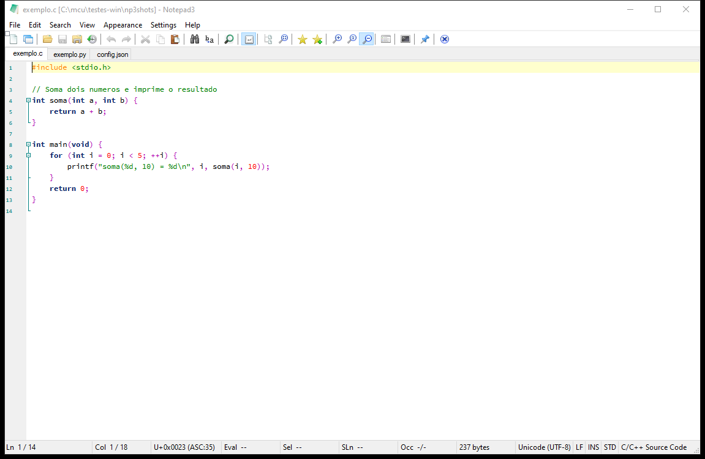
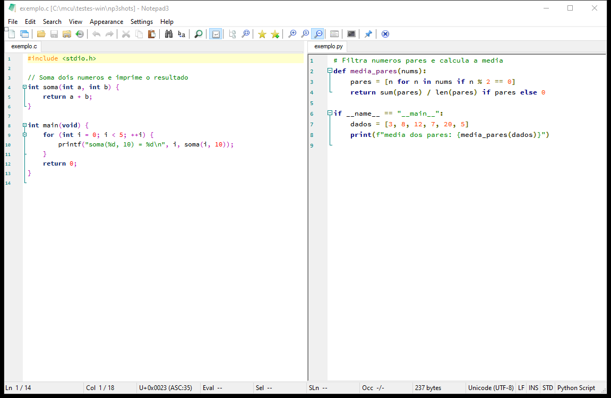

# Notepad3 Plus

Editor de texto **leve e nativo** para Windows com **abas** e **editores divididos
(split estilo Visual Studio)** — a praticidade de uma IDE sem o peso de um Electron.
Fork do [Notepad3](https://github.com/rizonesoft/Notepad3).

*A lightweight, native Windows text editor with tabs and Visual-Studio-style split
editors. — 🇧🇷 PT / 🇺🇸 EN below.*

| Abas / Tabs | Split |
|---|---|
|  |  |

## ⬇️ Download

Baixe o **[Notepad3Plus-x64.exe](https://github.com/rodrigo-p-a/notepad3plus/releases/latest)** e execute. É um único arquivo portátil — sem instalador.
*Download the single portable `Notepad3Plus-x64.exe` and run it.*

## ✨ O que faz / Features

- **Abas** e **split de painéis** (lado a lado / empilhado), cada um um editor vivo.
- **Arrastar e grudar** abas entre painéis (dock estilo VS).
- **Lembra sozinho**: ao fechar, guarda tudo (até não-salvos) e reabre igual.
- **Reabrir aba fechada**, **renomear aba sem salvar**, várias abas em branco.
- **Instalar/Desinstalar** pelo menu (atalho *notepad3pp*) + **Atualizar** baixando
  a última versão direto do GitHub (e auto-update local).
- **1 exe portátil**, nativo, ~50 MB de RAM, sem dependências.

> Ações no **clique direito da aba**. Atalhos: `Ctrl+N` nova aba · `Ctrl+PgUp/PgDn`
> trocar · clique do meio fecha · arrastar move/divide.

## ⚡ Por que em vez do VS Code? / Why over VS Code?

| | **Notepad3 Plus** | VS Code |
|---|---|---|
| RAM | **~50 MB** | ~300–700 MB |
| Tamanho / Size | **1 exe (~18 MB, todos os idiomas)** | ~350 MB+ |
| Tecnologia / Tech | **nativo C/Win32** | Electron |
| Início / Startup | **instantâneo** | segundos |

Para edição simples (textos, código pequeno, configs), entrega tabs+split rápidos e
leves. *For simple editing it gives fast, light tabs + split.*

## 🛠️ Build

```bat
powershell -ExecutionPolicy Bypass -File Version.ps1
msbuild Notepad3.sln /m /p:Configuration=Release /p:Platform=x64
powershell -ExecutionPolicy Bypass -File Build\embed_minipath.ps1
```
Saída / output: `Bin\Release_x64_v143\NotePad3Plus.exe` (o `embed_minipath.ps1`
gera esse nome a partir do `Notepad3.exe` compilado).

## 📄 Créditos / Credits

Ideia e direção / idea & direction: **Rodrigo** · Implementação (co-autor) /
implementation (co-author): **Claude Opus 4.8**.
Base: [Notepad3](https://github.com/rizonesoft/Notepad3) © Rizonesoft (BSD-3-Clause).

Detalhes em [MELHORIAS.md](MELHORIAS.md) · histórico em [CHANGELOG.md](CHANGELOG.md).
